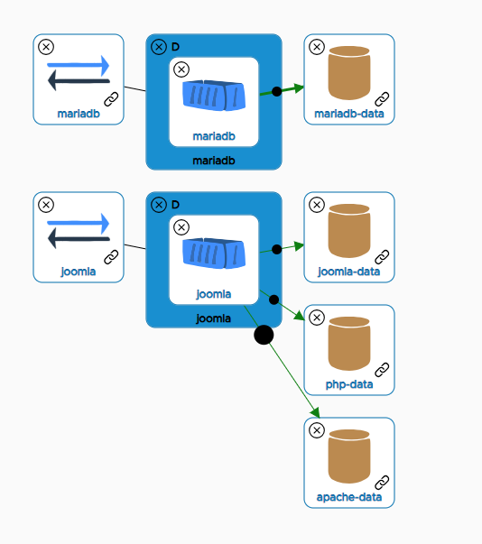

| Component | Status |
| --- | --- |
| API | []( https://g.codefresh.io/pipelines/yipee-api/builds?repoOwner=yipeeio&repoName=yipee&serviceName=yipeeio%2Fyipee&filter=trigger:build~Build;branch:master;pipeline:5c17da456ecec36a696fc9d9~yipee-api) |
| Converter | []( https://g.codefresh.io/pipelines/yipee-converter/builds?repoOwner=yipeeio&repoName=yipee&serviceName=yipeeio%2Fyipee&filter=trigger:build~Build;branch:master;pipeline:5bef457d6c5eee3723a18ead~yipee-converter) |
| UI | []( https://g.codefresh.io/pipelines/yipee-ui/builds?repoOwner=yipeeio&repoName=yipee&serviceName=yipeeio%2Fyipee&filter=trigger:build~Build;branch:master;pipeline:5c197e2fc3fb12fd170b62a2~yipee-ui) |

# Yipee - Graphical Kubernetes Editing
Working with Kubernetes doesn't _necessarily_ imply spending quality
time with YAML. For the last couple of years, Yipee.io has provided
SaaS-based graphical Kubernetes modeling at `https://app.yipee.io` and
many people have taken advantage of this to avoid "YAML Hell".
Throughout the development of the SaaS application, however, we heard
from a sizeable segment of our users that they would like to have an
on-premise, preferably open source, version of our tool. Well, here it
is...

## What does it do?
This repository contains the pure Kubernetes editing functionality
from the original Yipee.io application but drops the SaaS-related
parts. So, there are no teams, no model storage, and no authentication
or authorization. Instead, you can simply point the application at a
YAML file and edit your model graphically before saving it back out.

## What does a model look like?
Here is a simple Joomla model:



It should be easy to understand the big picture.

The YAML for this model is:

``` yaml
apiVersion: v1
kind: Service
metadata:
  name: joomla
spec:
  selector:
    name: joomla-kubernetes
    component: joomla
  ports:
  - port: 80
    targetPort: 80
    name: joomla-80
    protocol: TCP
  - port: 443
    targetPort: 443
    name: joomla-443
    protocol: TCP
  type: ClusterIP

---
apiVersion: v1
kind: Service
metadata:
  name: mariadb
spec:
  selector:
    name: joomla-kubernetes
    component: mariadb
  ports:
  - port: 3306
    targetPort: 3306
    name: mariadb-3306
    protocol: TCP
  type: ClusterIP

---
apiVersion: extensions/v1beta1
kind: Deployment
metadata:
  name: joomla
spec:
  selector:
    matchLabels:
      name: joomla-kubernetes
      component: joomla
  template:
    spec:
      imagePullSecrets: []
      containers:
      - volumeMounts:
        - mountPath: /bitnami/joomla
          name: joomla-data
        - mountPath: /bitnami/php
          name: php-data
        - mountPath: /bitnami/apache
          name: apache-data
        name: joomla
        env:
        - name: JOOMLA_EMAIL
          value: user@example.com
        - name: JOOMLA_PASSWORD
          valueFrom:
            configMapKeyRef:
              key: JOOM_PASSWORD
              name: joomlaconfig
        - name: JOOMLA_USERNAME
          value: root
        - name: MARIADB_HOST
          value: mariadb2
        - name: MARIADB_PASSWORD
          valueFrom:
            configMapKeyRef:
              key: MARIA_PASSWORD
              name: joomlaconfig
        - name: MARIADB_PORT
          value: '4306'
        ports:
        - containerPort: 80
          protocol: TCP
        - containerPort: 1776
          protocol: TCP
        - containerPort: 443
          protocol: TCP
        image: bitnami/joomla:latest
      volumes:
      - name: php-data
        persistentVolumeClaim:
          claimName: php-data-claim
      - name: apache-data
        persistentVolumeClaim:
          claimName: apache-data-claim
      - name: joomla-data
        persistentVolumeClaim:
          claimName: joomla-data-claim
      restartPolicy: Always
    metadata:
      labels:
        name: joomla-kubernetes
        component: joomla
  strategy:
    type: RollingUpdate
    rollingUpdate:
      maxSurge: 1
      maxUnavailable: 1
  replicas: 1
  revisionHistoryLimit: 2

---
apiVersion: extensions/v1beta1
kind: Deployment
metadata:
  name: mariadb
spec:
  selector:
    matchLabels:
      name: joomla-kubernetes
      component: mariadb
  template:
    spec:
      imagePullSecrets: []
      containers:
      - volumeMounts:
        - mountPath: /bitnami/mariadb
          name: mariadb-data
        name: mariadb
        env:
        - name: ALLOW_EMPTY_PASSWORD
          value: 'yes'
        - name: MARIADB_PORT
          value: '3306'
        - name: MARIADB_ROOT_PASSWORD
          valueFrom:
            configMapKeyRef:
              key: MARIA_PASS
              name: joomlaconfig
        ports:
        - containerPort: 3306
          protocol: TCP
        image: bitnami/mariadb:10.1.26-r2
      volumes:
      - name: mariadb-data
        persistentVolumeClaim:
          claimName: mariadb-data-claim
      restartPolicy: Always
    metadata:
      labels:
        name: joomla-kubernetes
        component: mariadb
  strategy:
    type: RollingUpdate
    rollingUpdate:
      maxSurge: 1
      maxUnavailable: 1
  replicas: 1
  revisionHistoryLimit: 2

---
apiVersion: v1
kind: PersistentVolumeClaim
metadata:
  name: apache-data-claim
spec:
  accessModes:
  - ReadWriteOnce
  resources:
    requests:
      storage: 2G
  volumeMode: Filesystem

---
apiVersion: v1
kind: PersistentVolumeClaim
metadata:
  name: php-data-claim
spec:
  accessModes:
  - ReadWriteOnce
  resources:
    requests:
      storage: 2G
  volumeMode: Filesystem

---
apiVersion: v1
kind: PersistentVolumeClaim
metadata:
  name: joomla-data-claim
spec:
  accessModes:
  - ReadWriteOnce
  resources:
    requests:
      storage: 2G
  volumeMode: Filesystem

---
apiVersion: v1
kind: PersistentVolumeClaim
metadata:
  name: mariadb-data-claim
spec:
  accessModes:
  - ReadWriteOnce
  resources:
    requests:
      storage: 2G
  volumeMode: Filesystem
```

## What about Docker Compose?
The editor can import Docker Compose files. They will be turned into
Kubernetes models on import. There is no support for going in the
other direction. The Compose support is provided to help in migrating
to Kubernetes.

## Where do we go from here?
That's partly up to you! Yipee is open source now and we welcome
collaborators and contributors. If you have an idea or opinion as to
future directions, we're listening.

# Installation
Yipee is ready to run as a kubernetes application.  Public
images built from the master branch of this repo are available in
dockerhub.  The _yipee.yaml_ file in this repo defines the kubernetes
objects needed to deploy the app.  The full version of yipee will
read the kubernetes cluster and allow modification and update of
deployed applications.  You can also import yaml files, make
modifications in the editor and deploy the results to your cluster.

To run yipee in a local minikube, simply:

```
kubectl apply -f yipee.yaml
minikube -n yipee service yipee-ui
```

To run just the yipee editor (without support for reading from or
deploying to kubernetes), do this instead:

```
kubectl apply -f editor.yaml
minikube -n yipeeed service yipee-ui
```

To deploy in a cloud-based cluster, you will want to change the type of
the _yipee-ui_ service definition from _NodePort_ to _LoadBalancer_
(or create an ingress).

# Build from Source
## Prerequisites
- docker
- bash
## Building Images
You can build images from source by running _build.sh_ at the top of
the repo.  By default this will produce three images:
- yipee-converter
- yipee-api
- yipee-ui

## Run with Locally Built Images
- push the images to your kubernetes cluster
- modify _yipee.yaml_ to reference those images
- apply the modified yipee.yaml

# Integration with other tools
We've exposed an API that allows you to post your YAML file then open the browser with that file loaded.  This is to aid integration with things like `kubectl edit`

## API
URL: /api/import?store=true Content-Type: application/json<br/>
Payload: Json object with a name:string and importFile:base64 encoded YAML<br/>
Return: Json object success:boolean, total:int, data:[{name:string, guid:string}]

Take the guid returned from the import and open your browser to /editor/<guid>

### Example
file import_test.json<br/>
{"name":"test_import", "importFile":"IyBHZW5lcmF0ZWQg...=="}

`curl -v -d @import_test.json "http://35.193.60.29:8080/api/import?store=true" -H "Content-Type: application/json"`

{"success":true,"total":1,"data":[{"name":"test_import","guid":"659a74c2-310b-4d48-a0e3-cd45fd7c6e7c"}]}

`open http://35.193.60.29:8080/editor/659a74c2-310b-4d48-a0e3-cd45fd7c6e7c`


